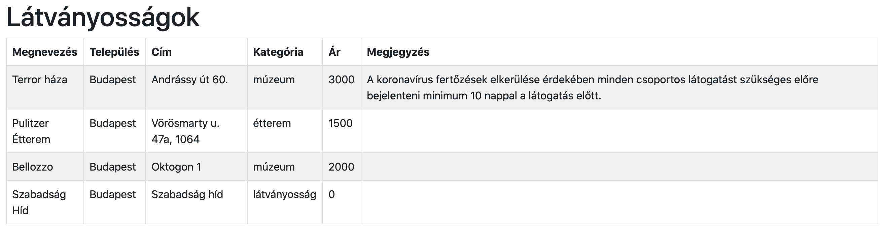
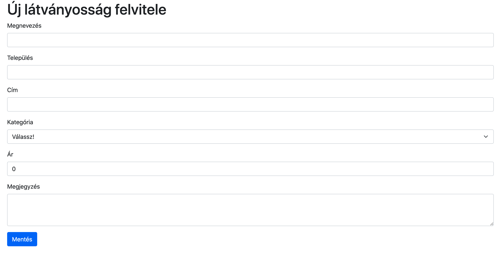
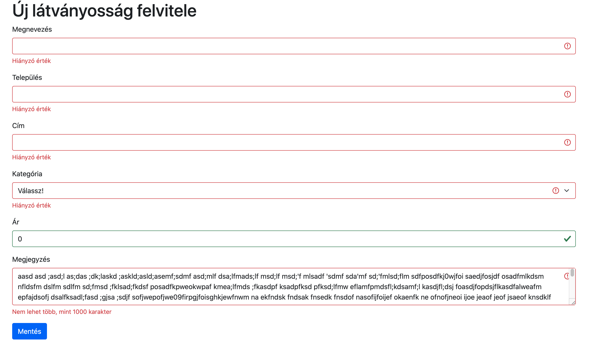
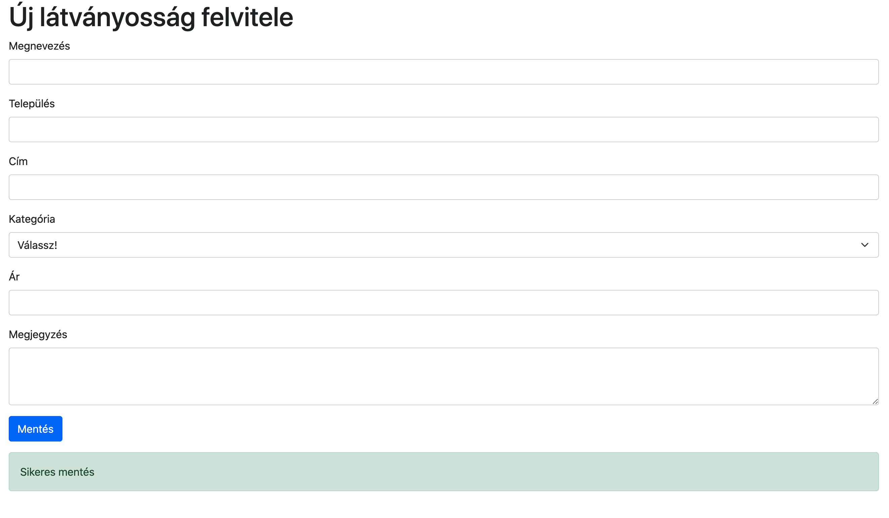

# Tourist Inform

Építs egy webalkalmazást, aminek segítségével meg lehet találni a városokban lévő
látványosságokat.

## Kezdeti lépések

- Fork-old ezt a repository-t a saját account-odra
- Klónozd a fork-olt repository-t a saját számítógépedre
- Készíts egy `.gitignore` file-t, hogy a generált file-ok ne szerepeljenek
  a commit-odban
- Commit-olj gyakran és az üzenetek legyenek elég deskriptívek
- Minden válasz és megoldás kerüljön ebbe a repository-ba
- Olvasd végig figyelmesen a feladatokat és csak utána láss neki a megoldásnak

## Tartsd észben

- Bármilyen online forrást használhatsz, de **kérlek dolgozz egyedül!**

- **Ne csak copy-paste-eld** a válaszokat és megoldásokat,
  inkább használd a saját szavaidat

- **Ne push-olj** GitHub-ra, amíg a mentorod be nem jelenti, hogy eljött az idő

## Feladatok

## Általános követelmények

- A kiindulókódban megtalálható a tourist-inform aktuális állapotának táblázata,
  ezt kell kiegészíteni 5 új funkcióval és hatodik feladatként hostolni a Firebase szolgáltatónál.
- Az adatkezléshez a Firestore online NoSQL adatbáziskezelőt kell használni.
- Megjelenésben a Bootstrap 5 CSS keretrendszer használandó SCSS stílussal
- használható npm packagek: `bootstrap`, `bootstrap-icons`,
  `firebase`, `react`, `react-dom`, `react-router-dom`, `react-scripts`, `node-sass`, `sass`, `validator`, `web-vitals`

## Feladatsor főbb pontjai

1. feladat: Statisztika táblázat készítése
1. feladat: Szűrés településre 
1. feladat: Szűrés éttermekre 
1. feladat: Látványosság törlése 
1. feladat: Új látványosság felvitele
1. feladat: Weboldal hosztolása

## Adatbázis

Adatbázishoz használj Firestore-t:
- Engedélyezd az `anonymous` beléptetést az `Authentication` menüpont alatt.
- Hozz létre egy adatbázist Firestore alatt
- A `tourist-information/src/firebase/config.example.js` file alapján készíts ugyanabban a könyvtárban egy `config.js`
  file-t, a projektedhez tartozó beállításokat használd.
- Készíts egy `attractions` collection-t Firestore-ban
- (Opcionális) példa adatok feltöltéséhez futtasd a `tourist-information`
  könyvtárban állva a `yarn loadData` vagy `npm run loadData` utasítást.

### Kiinduló állapot

## 1. feladat: Statisztika táblázat készítése

- A táblázat alatt szerepeljen egy statisztika táblázatban,
  hogy településenként hány darab látványosság található és településenként mennyi átlagosan a látogatási ár.
- az első oszlop a településeket tartalmazza (`Település`)
- a második oszlop az adott telelpüléshez tartozó látványosságok darabszámainak összegét mutassa. (`Látványosságok`)
- a harmadik oszlop az adott telelpüléshez tartozó látogatási ár átlagát tartalmazza. (`Átlag ár`)
- az utolsó sorban legyen az összegzés
- az adatok kiszámolásához JavaScript kódot használj (ne adatbázis aggregáló
  függvényt)
- Táblázat szerkezete (az értékek fiktívek benne):
- Használj Bootstrap osztályokat

| Település     | Látványosságok | Átlag ár |
|---------------|----------------|----------|
| Budapest      | 5              | 1000     |
| Pécs          | 2              | 2000     |
| Szeged        | 3              | 3000     |
| **Összegzés** | **10**         | **2000** |

## 2. feladat: Szűrés településre

- A adattáblázat felett legyen egy "Település" címkével ellátott dropdown (`select`).
- A Település választót használva a táblázat legyen leszűrve a kiválaszott település alapján
- A listában lévő települések mellett legyen egy "Válassz!" opció is.
- A "Válassz!" opció legyen alapértelmezetten kiválasztva és ebben az esetben az összes adatot mutassa
- Firebase-ből a kiválasztott opciónak megfelelően legyenek az adatok lekérve és megjelenítve a táblázatban
- Használj Bootstrap osztályokat

## 3. feladat: Szűrés éttermekre

Egy checkbox segítségével szűrd le és frissítsd a táblázat tartalmát

- A checkbox címkéje 'Csak éttermek' legyen
- Ha a checkbox ki van választva, akkor csak az éttermeket mutassa a táblázat
- Ha a checkbox üres, akkor az összes típusú látványosságot mutassa
- Firebase-ből vegye a táblázat az adatait
- Használj Bootstrap osztályokat

## 4. feladat: Látványosság törlése

- Legyen a főoldali táblázatban egy új oszlop 'Műveletek' elnevezéssel
- A 'Műveletek' oszlop minden sorába kerüljön egy `delete-{id}` azonosítót
  tartalmazó "Törlés" felirítú gomb (`{id}` helyére az adott település `id`-ja kerüljön)
- A táblázatban található "Törlés" gomb megnyomására
  törlődjön az aktuális sor a táblázatból és a FireStore adatbázisból is.
- Használj Bootstrap osztályokat

## Új látványosság felvitele

- A táblázat felett legyen egy "Felvitel" feliratú gomb,
  aminek megnyomására a `/attraction/new` oldalra navigál az applikáció oldalújratöltés nélkül.

## Űrlapok

### Űrlap mezők

- Megnevezés `name`
  - szöveges mező
  - kitöltése kötelező
- Település `settlement`
  - szöveges mező
  - kitöltése kötelező
- Cím (utca, házszám) `address`
  - szöveges mező
  - kitöltése kötelező
- Kategória `category`
  - legördülő menü (select)
  - a következő értékeket veheti fel: "múzeum", "étterem", "építmény"
  - kiválasztása kötelező
- Ár `price`
  - szám mező
  - kitöltése kötelező
  - nem vehet fel negatív értéket
  - ha az érték kisebb, mint 0, akkor a következő legyen kiírva a mező alá:
    "Nem lehet kisebb, mint 0"
- Megjegyzés `note`
  - textarea típusú
  - kitöltése opcionális
  - maximum 1000 karakter hosszú lehet
  - ha több, mint 1000 karaktert tartalmaz,
    akkor a következő hibaüzenet legyen kiírva a mező alá: "Nem lehet több, mint 1000 karakter"

### Űrlapok alapértelmezett működése

- mező elhagyásakor (is) legyen validáció
  - kötelezően kitöltendő mező esetén a "Hiányzó érték" szöveg legyen megjelenítve
- legyen egy "Mentés" gomb az űrlap aljában
- a "Mentés" gomb megnyomására (is) legyen validálva az űrlap

### Látványosság létrehozása oldal `/attraction/new`

- A "Mentés" gomb megnyomására legyen elmentve a látványosság adatbázisba
- Sikeres adatbázisba mentés után:
  - az űrlap mezői legyenek kiürítve
  - jelenjen meg egy sikerességet jelző Bootstrap alert a következő szöveggel: "Sikeres mentés"

#### Alap nézet

#### Invalid állapot

#### Sikeres állapot

